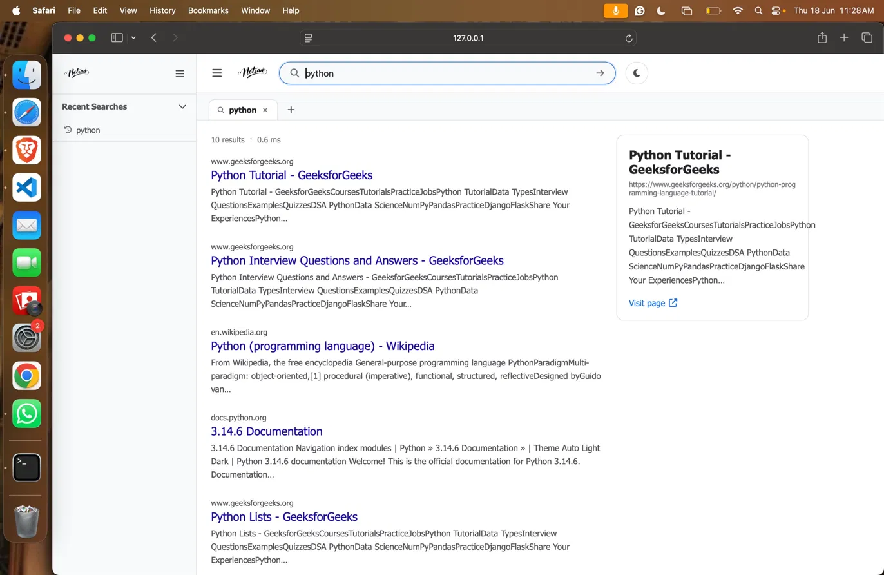
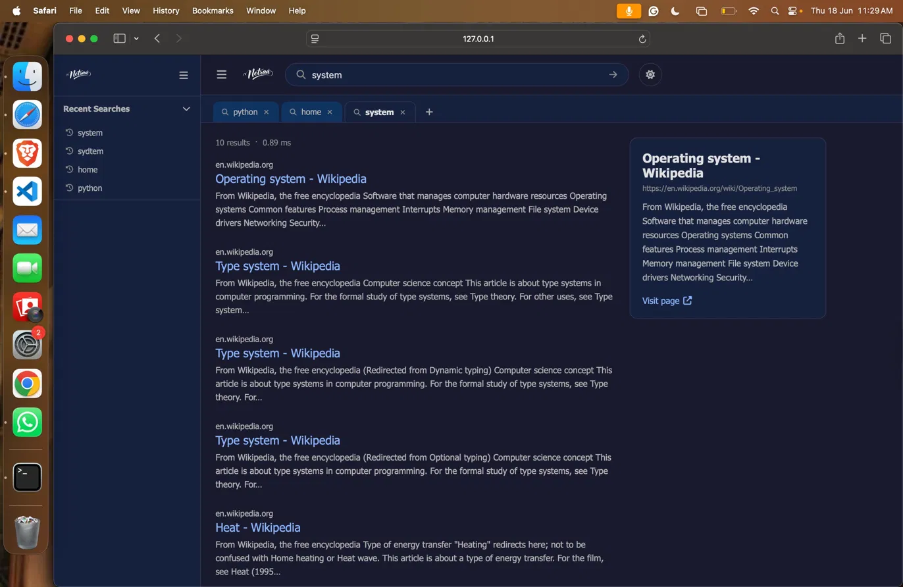
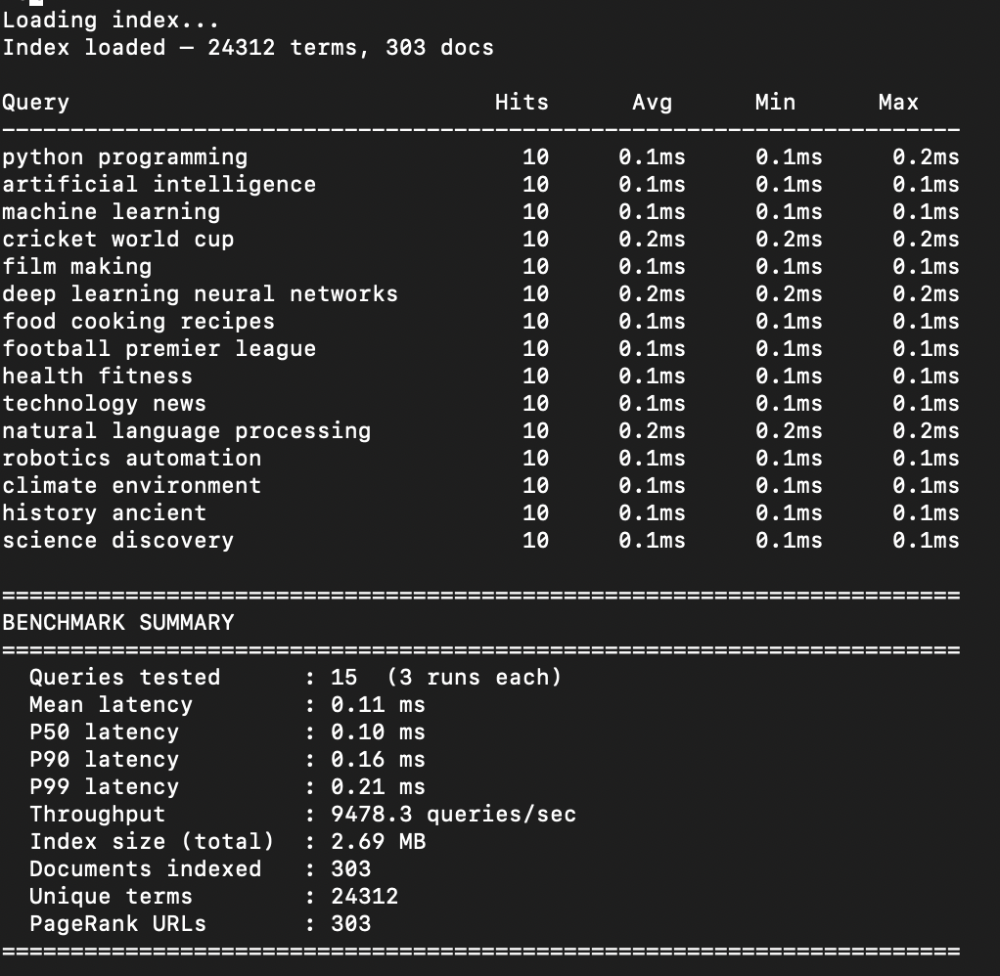

# Netraa — High-Performance Search Engine

A production-grade search engine built from scratch in Python that crawls the web, constructs a custom inverted index, ranks documents using **BM25 + PageRank**, and serves search queries with **sub-millisecond latency**.

**Keywords:** Distributed Systems, Concurrency, Multi-threading, Synchronization, Data Structures, Algorithms, Software Design, Backend Engineering, Artificial Intelligence, Machine Learning, Performance Optimization

---

## Screenshots

### Home


### Search Results — Light Mode


### Search Results — Dark Mode


### Recent Searches


### Benchmark Output


---

## Key Highlights

- Architected and implemented a **complex end-to-end search system** covering web crawling, parsing, indexing, ranking, and query serving.
- Developed a **high-performance concurrent crawling pipeline** using `asyncio`, asynchronous I/O, and synchronization-safe shared resources.
- Applied advanced **data structures and algorithms** including inverted indexes, posting lists, graph traversal, BFS, and ranking functions.
- Designed scalable backend architecture using **modular software design principles** for maintainability and extensibility.
- Built a custom **information retrieval engine** using BM25 scoring for relevance-aware document ranking.
- Implemented **graph-based ranking algorithms** using PageRank and iterative convergence over a directed link graph.
- Optimized system for **low latency, high throughput, reliability, and performance**, achieving sub-millisecond query serving.
- Performed extensive **benchmarking, systems analysis, debugging, and performance tuning** across indexing and retrieval pipelines.
- Designed architecture extensible toward **machine learning, semantic search, and large-scale indexing**.

---

## System Architecture

```text
Web → Crawler → Parser → Inverted Index (BM25) → Query Processor → Flask UI
                                  ↓
                           PageRank Graph
```

---

## Technical Overview

### Web Crawler (`crawler/`)

Netraa uses a high-throughput asynchronous crawler built with `asyncio` and `aiohttp`.

#### Features
- BFS-based URL frontier
- Duplicate URL filtering
- `robots.txt` compliance
- Per-domain politeness limits
- Concurrency control using `asyncio.Semaphore`
- CommonCrawl fallback for sparse results

---

### Indexing Pipeline (`indexer/`)

Raw HTML documents are transformed into searchable structured data through:

- HTML content extraction
- Text normalization
- Tokenization
- Stopword removal
- Suffix stemming

A custom inverted index maps terms to posting lists weighted using BM25.

#### BM25 Parameters

```python
k1 = 1.5
b = 0.75
```

---

### PageRank Engine (`indexer/pagerank.py`)

A directed graph is constructed from inter-document hyperlinks to compute authority scores.

#### Parameters

```python
damping_factor = 0.85
convergence_threshold = 1e-6
```

Features:
- Directed link graph construction
- Dangling node redistribution
- Iterative convergence
- Score normalization

---

### Query Processor (`query/processor.py`)

Query processing pipeline:

1. Query tokenization and stemming
2. BM25 score retrieval
3. Score normalization
4. Hybrid score fusion
5. Top-K ranking

#### Ranking Formula

```python
score = 0.8 * bm25 + 0.2 * pagerank
```

---

## Performance Benchmarks

Measured across multiple benchmark runs on a 303-document corpus.

| Metric | Value |
|---|---|
| Mean Latency | 0.11 ms |
| P50 Latency | 0.10 ms |
| P90 Latency | 0.16 ms |
| P99 Latency | 0.21 ms |
| Throughput | 9,478 QPS |
| Index Size | 2.69 MB |

### Dataset Statistics
- 303 crawled documents
- 24,312 unique indexed terms
- 3,310 directed graph edges

Run benchmark:

```bash
python benchmark.py
```

---

## Setup

```bash
git clone https://github.com/yourusername/netraa
cd netraa

python -m venv venv
source venv/bin/activate

pip install -r requirements.txt
```

---

## Usage

### 1. Crawl and Build Index

```bash
python rebuild.py
```

### 2. Generate PageRank Scores

```bash
python indexer/pagerank.py
```

### 3. Run Benchmark

```bash
python benchmark.py
```

### 4. Launch Search Engine

```bash
python ui/app.py
```

Open:

```text
http://127.0.0.1:5000
```

---

## Project Structure

```text
netraa/
├── crawler/
│   ├── crawler.py
│   ├── frontier.py
│   ├── common_crawl.py
│   └── robots_parser.py
├── indexer/
│   ├── indexer.py
│   ├── parser.py
│   └── pagerank.py
├── query/
│   └── processor.py
├── ui/
│   ├── app.py
│   ├── templates/
│   └── static/
├── data/
├── assets/
├── benchmark.py
├── rebuild.py
└── requirements.txt
```

---

## Tech Stack

| Layer | Technology |
|---|---|
| Language | Python 3.9 |
| Crawling | aiohttp, asyncio |
| Parsing | BeautifulSoup, lxml |
| Indexing | Custom Inverted Index |
| Ranking | BM25 + PageRank |
| Backend | Flask |
| Benchmarking | perf_counter |

---

## Core Engineering Concepts

- Distributed Systems
- Concurrent Systems
- Synchronization
- Software Architecture
- Data Structures
- Algorithms
- Information Retrieval
- Search Ranking
- Graph Algorithms
- Backend Engineering
- Performance Optimization
- Reliability Engineering
- Debugging
- Artificial Intelligence
- Machine Learning

---

## Design Decisions

### Why Async Concurrency?
The crawler is I/O-bound. Asynchronous concurrency improves throughput while minimizing thread context-switching overhead.

### Why BM25?
BM25 outperforms TF-IDF by applying document-length normalization and probabilistic relevance scoring.

### Why PageRank?
Lexical similarity alone cannot identify authoritative documents. PageRank introduces graph-based authority signals.

### Why Hybrid Ranking?
Combining lexical scoring and graph-based ranking improves search relevance and ranking quality.

### Scalability Considerations
The architecture uses modular indexing, concurrent processing, and extensible ranking pipelines to support future large-scale deployment.

---

## Future Improvements

- Distributed sharded indexing
- Semantic search using dense vector embeddings (FAISS)
- Query autocomplete
- Learning-to-Rank models
- Spell correction
- Index compression using delta encoding
- Neural reranking